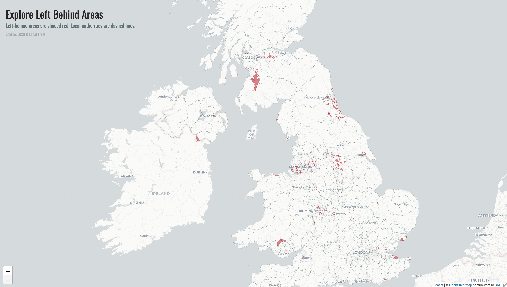

# Left Behind Areas

## Overview
An R Shiny web app to visualise left-behind areas, which are places high in
deprivation, and low in social infrastructure. Access it [here](https://britishredcross.shinyapps.io/left-behind-areas/).

